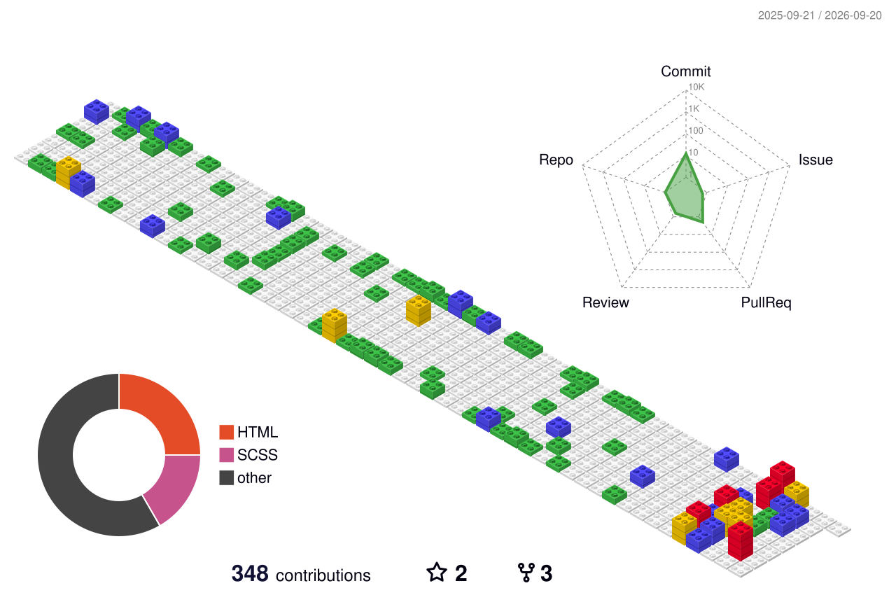

## 🤘 Hello, World!

Olá, meu nome é Maycon Araujo, ou “Maycosoft” (é como me chamam agora).Sou um estudante apaixonado por tecnologia e inovações.

- 📚 Estuadante de Análise e Desenvolvimento de Sistemas pela Univiçosa.
- 🚀 Atualmente estou trabalhando com React Native e TypeScript e estudando python paralelamente.

👨‍💻 Mais sobre mim

  - 💬 Tenho 22 anos e atualmente moro em Viçosa/MG. Tenho experiência em Design, Wordpress, Python e Arduino. Também trabalho com manutenção de computadores desde 2017, o que me motivou a interessar por tecnologia e resolver problemas.
  - ⚡ Gosto de jogar, escutar música, ver um filme e ler.  Acredito que nossos interesses pessoais ajudem para a resolução de problemas e criatividade.

##

###
## 💻 Tecnologias e Ferramentas:

  
  
  
  
  
  
  
  
  
  
  
  
  
  
  
  
  
  
  
  
  

## 📈 Minhas contribuições

